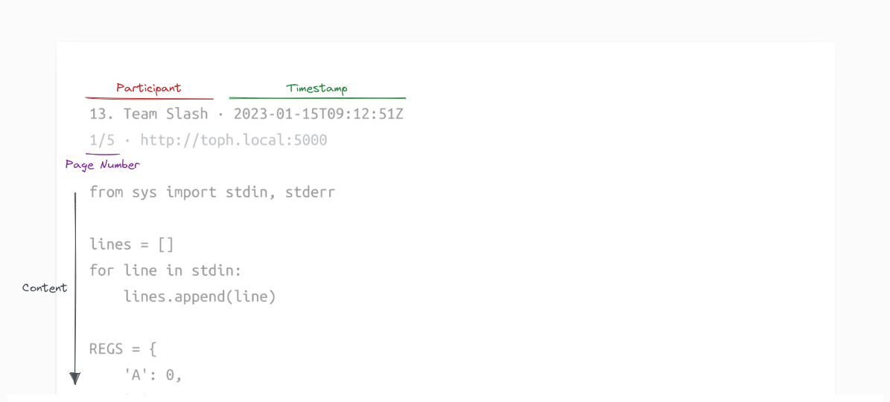

# Printd

Allow participants to request prints right from within Toph. Process print jobs locally using Printd.


You will have to download Printd and run it on a local computer connected to a printer.

If the computer with the printer has Linux on it, you will need to ensure that CUPS is installed and the printer is configured correctly.

You will also need a [configuration file](#configuration) for Printd. This configuration file is contest-specific. You can download this configuration file from Toph once the printing feature is enabled for your contest.

## Example

[An example](example/example.pdf) is included in this repository.



Every page printed is prepended with a header. Prints by participants show the participant number and name or account handle in the header. Test prints show "‹Test Print›" in the header instead.

The contest title, the timestamp of when the print was requested, and page numbers are also included in the header.

## Dependencies

Linux:

- CUPS: Printd uses `lpr` to dispatch the print job to the printer.

Windows:

- [PDFtoPrinter](http://www.columbia.edu/~em36/pdftoprinter.html): Printd uses `PDFtoPrinter` to dispatch the print job to the printer. Download PDFtoPrinter.exe and put it in the same directory as printd.exe.

## Usage

```
» ./printd -h
Usage of ./printd:
  -config string
    	path to configuration file (default "printd-config.toml")
```

## Configuration

``` toml
[printd]
fontSize = 13        # In px. All text uses this same font size.
lineHeight = 20      # In px. Must be larger than fontSize.
marginTop = 50       # Margin at the top edge of each page.
marginRight = 25     # ... on the right edge of each page.
marginBottom = 50    # ... on the bottom edge of each page.
marginLeft = 25      # ... on the left edge of each page.
tabSize = 4          # Replaces tabs with this many spaces.
keepPDF = true       # When true, does not delete generated PDF after print.
delayAfter = "500ms" # Delay forced after each print.

[printer]
name = "..."    # Name of the printer. Leave empty to use the system default.
pageSize = "A4" # Size of the page. Use one of "A4", "letter", or "legal".

[toph]
baseURL = "https://toph.co"
token = "..."               # Collect your printd token from Toph Support. The token is contest-specific.
contestID = "..."           # The 24 character hex ID of the contest goes here.
```

## To-dos

- [x] Windows support
- [ ] Improve tab-to-spaces behavior
